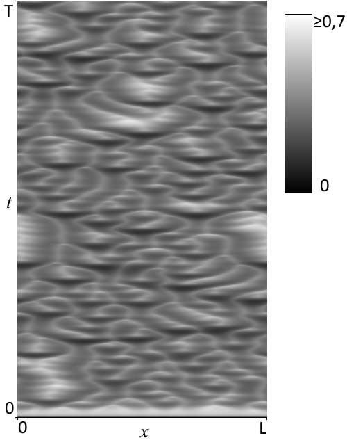
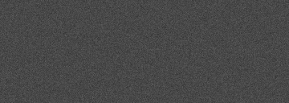

# Kompiuterinis švytinčių bakterijų formuojamų struktūrų modeliavimas

## Viendimensis modelis. Išvesties pavyzdys
|Bakterijų koncentracija|Chemoatraktanto koncentracija|
|--|--|
|||

|Konstanta|Reikšmė|
|-|-|
|_Du_|0,1|
|_χ_|8,3|
|_αu_|1|
|_βv_|0,73|
|_Δx_|0,075|
|_Δt_|0,00005|

## Dvidimensis modelis. Išvesties pavyzdys
|bakterijų koncentracija|chemoatraktanto koncentracija|
|--|--|
|||
